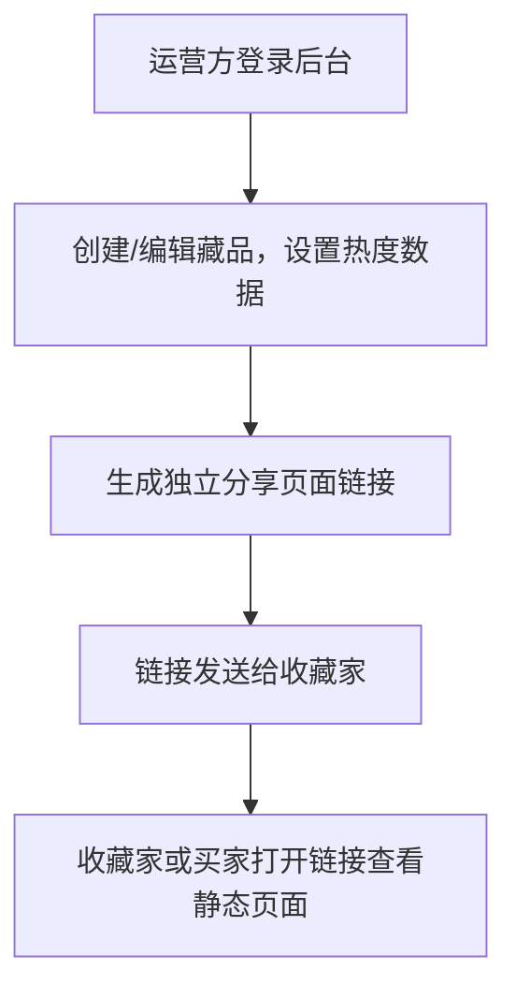

# 藏品拍卖交流平台产品需求文档 (V1.0 - 第一期)

## 一、项目概述
### 1.1 项目背景
这是一个专注于收藏品展示与交易的轻量级平台，运营方作为中介连接收藏家和潜在买家。平台不直接处理交易，而是通过藏品展示、热度数据可视化和即时沟通，促进线下交易达成。

### 1.2 产品定位
- **业务模式**：C2B2C模式，运营方（B端）作为中间服务商
- **核心价值**：为民间收藏家提供专业的藏品展示渠道，为买家提供可信的藏品信息
- **差异化**：
  - 通过虚拟热度数据制造稀缺感，激发购买欲望
  - 独立分享页面机制，保护藏家隐私，防止藏品信息交叉曝光
  - 专注小程序生态，提供流畅的移动端体验

### 1.3 用户角色 (第一期范围)
| 角色 | 核心需求 | 使用场景 |
|------|---------|---------|
| **运营方 (核心)** | 高效管理藏品信息，生成并分发藏品专属链接 | 后台录入/编辑藏品信息，配置热度数据，复制链接发送给收藏家 |
| **收藏家** | 查看专属藏品页面，了解藏品展示效果 | 从运营方收到独立分享链接，打开查看 |
| **买家/普通用户** | 浏览藏品信息 | 通过首页浏览，或通过分享链接进入特定藏品页 |

## 二、核心业务流程 (第一期)
### 2.1 整体流程

*(说明：点赞、评论、客服交互在第一期均为静态展示)*

### 2.2 页面访问路径
```
普通用户路径：
小程序首页 → 藏品列表 → 标准详情页（静态展示）

收藏家专属路径：
分享链接/小程序码 → 独立详情页（静态展示，无导航）
```

## 三、功能需求详述 (第一期)
### 3.1 买家端小程序
**核心调整**：所有互动元素（点赞、评论、客服）在前端均为静态UI展示，数据来自后台配置，点击无交互反馈。微信登录页仅为静态页面。

#### 3.1.1 标准版（从首页进入）
- **首页**：
  - 顶部Tab分类：钱币、字画、文玩、瓷器、杂项
  - 藏品列表：卡片式展示（封面图、标题、后台配置的浏览量/点赞数）
  - 顶部访客墙：显示5个固定头像 + 后台配置的总访问量
  - 右下角悬浮客服按钮（点击跳转至静态客服页）
  - **用户状态**：无需登录即可浏览所有内容。

- **标准详情页**：
  - 多媒体区：图片轮播（显示页码如“2/7”）
  - 信息区：标题、描述、唯一ID
  - **数据面板（静态展示）**：发布时间、**后台配置的**浏览量、点赞数、评论数
  - **互动区（静态UI）**：
    - 点赞按钮：显示为灰色轮廓大拇指图标，不响应点击。
    - 评论输入框：显示“点击登录后评论”字样，点击后跳转至**静态微信登录引导页**。
  - 导航：可返回首页，可分享。
  - 联系客服：点击跳转至**静态客服页面**。

#### 3.1.2 独立版（从分享进入）
- **独立详情页**：
  - 内容与标准详情页完全一致。
  - **关键差异**：自定义导航栏（仅标题和关闭按钮），禁用右滑返回，监听返回键直接退出小程序。
  - 分享功能：允许分享，新用户进入同样为独立详情页。

- **静态客服页**：
  - 页面样式：模仿聊天窗口界面。
  - 固定内容：展示预设的客服欢迎语、联系方式（如电话、二维码）或提示“请添加客服微信咨询”。
  - 导航逻辑：从独立页面进入则隐藏返回按钮，监听返回键退出小程序。

- **静态微信登录页**：
  - 设计一个引导用户登录的界面，展示微信登录按钮。
  - 点击按钮后提示“登录功能即将开放”或类似静态提示，不调用真实登录接口。

### 3.2 用户登录与权限 (第一期简化)
- **前端登录机制**：仅提供静态微信登录引导页，无实际登录逻辑。
- **权限控制**：
  - 所有用户（无论是否点击登录）在前端权限相同：**仅可浏览**。
  - 所有互动操作（点赞、评论、联系客服）点击后均导向静态提示页或静态客服页。
- **数据展示**：所有藏品的热度数据（浏览、点赞、评论数）均在运营后台设置，前端直接读取并展示。

### 3.3 运营方后台（Web端）- **第一期核心**
#### 3.3.1 藏品管理 (CRUD)
- **发布藏品**：
  - 基础信息：上传图片（最多10张，可排序）、输入标题、描述、选择分类。
  - **热度数据设置**：可手动设置初始“浏览量”、“点赞数”、“评论数”。
  - 发布后生成唯一藏品ID。
- **编辑藏品**：可修改除ID外的所有信息，包括已设置的热度数据。
- **删除藏品**：删除后，其分享链接应失效。
- **列表与搜索**：以列表形式展示所有藏品，支持按标题、ID、分类筛选。

#### 3.3.2 生成与分发
- **生成独立分享链接**：为每个藏品生成一个唯一的小程序码和链接，指向该藏品的“独立详情页”。
- **一键复制**：方便运营方将链接发送给收藏家。

#### 3.3.3 客服管理 (静态)
- 提供一个简单的页面，展示“客服工作台”的静态界面，可标注“消息功能后续迭代开通”。

## 四、运营需求 (第一期)
### 4.1 发布与分发流程
```
1. 运营方登录后台管理系统。
2. 创建新藏品，上传素材，填写信息，并设置初始热度（如：浏览量1000，点赞50，评论3）。
3. 发布藏品，系统生成独立的分享链接和小程序码。
4. 运营方将链接/小程序码发送给对应的收藏家。
5. 收藏家可自行分享给潜在买家，所有查看者看到的数据均为后台设置的值。
```

### 4.2 客服与咨询流程 (静态)
```
1. 买家在藏品页点击“联系客服”。
2. 进入静态客服页面，查看固定的联系方式（如客服二维码、电话）。
3. 买家通过页面展示的外部方式（如微信、电话）联系运营方。
4. 线下沟通并促成交易。
```

## 五、数据与接口说明 (第一期要点)
1.  **藏品数据表**：需包含`id`, `title`, `description`, `images`, `video`, `category`, `view_count`, `like_count`, `comment_count`, `create_time`等字段。其中`view_count`, `like_count`, `comment_count`可由后台直接编辑。
2.  **接口**：需提供完整的藏品CRUD接口。前端小程序仅调用藏品列表查询和单个藏品详情的只读接口。
3.  **分享链接**：每个藏品对应一个固定的小程序路径，如`pages/detail/independent?id=123`。

---
**附录：后续迭代功能提示**
- 用户系统与微信真实登录
- 点赞、评论的实时交互逻辑
- 浏览量的自动累计
- 客服实时消息系统
- 热度数据的动态变化算法
- 收藏家端数据看板